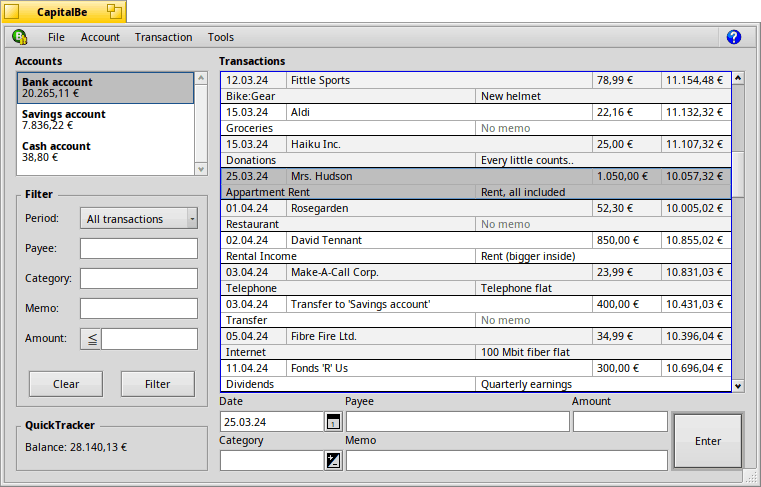

# CapitalBe

Personal finance manager for Haiku!



## Features

- QuickTracker: Know your net worth at a glance - your total cash minus your total debt. More kinds of calculations (income vs spending, etc.) coming in the first release.
- Quick Balance: Sometimes CapitalBe can balance your checkbook for you. If all the unreconciled transactions before the bank statement date have cleared, CapitalBe will do all the work for you.
- Fast Entry: CapitalBe will automatically complete what you type wherever possible. If you type in the word Split in for the category, it even pops up the Split window for you - no menu work needed.
- Open Format: CapitalBe uses the SQLite database to store its information, so there can be no funny business behind your back. Anyone with some experience in database programming can easily see exactly what is stored.
- Easy Reports: Other programs make finding out information to make financial decisions much harder than it needs to be. Not here.

## Documentation

For more details, see the [User documentation](http://htmlpreview.github.io/?https://github.com/HaikuArchives/CapitalBe/master/documentation/en/start.html).

## How to build

To build CapitalBe you need to have the sqlite development package installed:

```pkgman install devel:libsqlite3```

Then it's a simple ```make``` followed by ```make bindcatalogs``` to include translations.

For the Help to work, the contents of the "documentation" folder needs to be copied to, for example, ```/boot/home/config/non-packaged/documentation/packages/capitalbe```.

