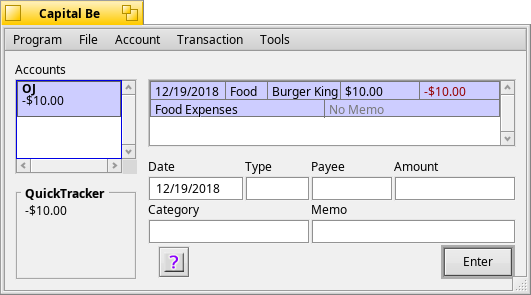

# CapitalBe


Personal finance manager for BeOS, Zeta, and Haiku!

## Features

QuickTracker - Know your net worth at a glance - your total cash minus your total debt. More kinds of calculations (income vs spending, etc.) coming in the first release.

Fast Balance - Sometimes Capital Be can balance your checkbook for you. If all the unreconciled transactions before the bank statement date have cleared, Capital Be will do all the work for you.

Fast Entry - Capital Be will automatically complete what you type wherever possible. If you type in the word Split in for the category, it even pops up the Split window for you - no menu work needed.

Open Format - Capital Be uses the SQLite database to store its information, so there can be no funny business behind your back. Anyone with some experience in database programming can easily see exactly what is stored.

Easy Reports - Other programs make finding out information to make financial decisions much harder than it needs to be. Not here.